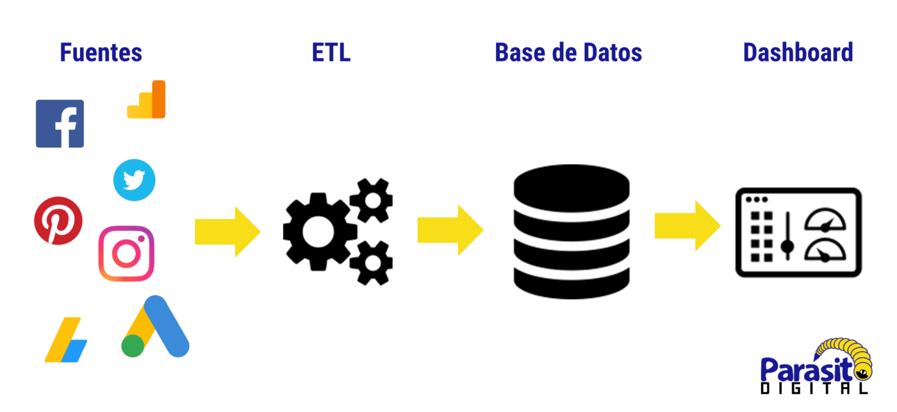

# ETL-Challenge

    

## Introduction

This project was created to aply ETL techiques to different datasets. The data was provided from different sources (Kaggle and the OMDB API’s):

- http://www.omdbapi.com/
- AllMoviesDetailsCleaned.csv
- IMDb_movies.csv
- Movies_metadata.csv
- Netflix_titles.csv
- Rotten_tomatoes_top_movies_2019-01-15.csv

Note: The files were not uploaded to the repository as they exceed the weight allowed by Github

First the data was extracted from the aforementioned sources, this was downloading the information directly in csv format and also making requests to the apis to obtain the data, after that the information was processed, cleaned and deleting NaN values and columns that weren't considered relevant, joining or merging different files to complete the datasets, separating values from columns and aggregating them into new ones, the columns were created according to the scheme that was planned,  this scheme was designed so that in the future the information can be analyzed, once this step was finished, the information was loaded into a relational database (PostgreSQL) in multiple tables.

Four catalogue tables were created which are: cat_genres, cat_original_language, cat_production_companies, and movies_details and a single detailed table called movies_db.

## Tools and Languajes

